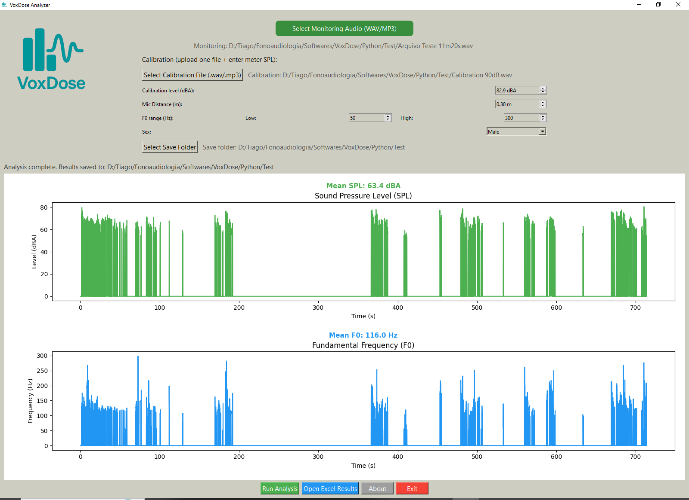
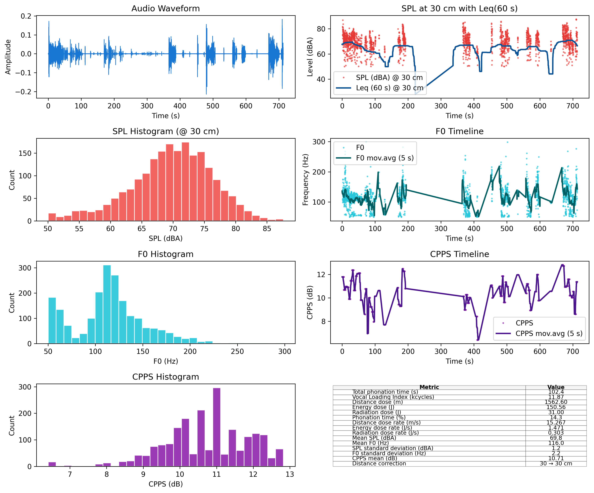

# VoxDose: Vocal Dose Analyzer

**VoxDose** is an open-source software for **vocal dose analysis**. It computes vocal load metrics from voice recordings, based on calibrated measurements of **Sound Pressure Level (SPL, dBA)** and **fundamental frequency (F0)**.

The algorithms were **originally developed in MATLAB by Prof. Pasquale Bottalico** and later adapted into Python for VoxDose (with permission). VoxDose enables researchers, clinicians, and voice professionals to objectively quantify vocal use during naturalistic recordings.

---

## Features

- Computes per-frame **SPL (dBA)** and **F0 (Hz)** from **`.wav`** or **high-quality `.mp3`** recordings (WAV preferred).
- Calibration using **one reference vowel recording** (subject + SLM/app measurement).
- Calculates vocal doses:
  - **Phonation time (Dt)**
  - **Vocal Loading Index (VLI)**
  - **Distance Dose (Dd)**
  - **Energy Dissipation Dose (De)**
  - **Radiation Dose (Dr)**
- Provides **mean and standard deviation** of SPL and F0.
- Exports results to **Excel spreadsheets** (`.xlsx`).
- Generates visualizations: waveform, SPL curve, and pitch curve.
- User-friendly **GUI built with PySide6** (Qt).
- Includes a splash screen and "About" dialog with credits.

---

## System Requirements

- Python 3.9+
- Recommended OS: Windows 10/11 or macOS 13+
- Dependencies:
  - `numpy`
  - `pandas`
  - `matplotlib`
  - `soundfile`
  - `scipy`
  - `PySide6`

Install all dependencies with:

```bash
pip install -r requirements.txt
```

> **Note on MP3:** MP3 import depends on your local `libsndfile` build (used by `soundfile`). WAV is recommended for maximum compatibility. If you record MP3, use **48 kHz / 320 kbps** or convert to WAV before analysis.

---

## Hardware and Calibration

To use VoxDose correctly, you need:

- A **contact microphone** or **head-mounted microphone**.
- A **portable recorder** capable of uncompressed `.wav` or high-quality `.mp3`.
- A **Sound Level Meter (SLM)** or a **reliable smartphone app** such as *dB Meter*.

### Monitoring Session (before analysis)

1. Attach the microphone to the subject and connect it to the portable recorder.
2. Record for the desired period (e.g., during one activity or an entire day).
3. At the end of the monitoring session, stop the recorder. You will analyze this file later in VoxDose.

### Calibration Procedure (single file)

1. Ask the subject to sustain the vowel **/a/** in a **habitual tone** (normal speaking pitch and loudness).
2. Place the **SLM/smartphone app** at **30 cm from the subject’s mouth** during recording.
3. Record the vowel using the **same microphone/recorder setup** that will be used for monitoring.
4. Note the **SPL value (in dBA)** shown by the SLM/app.
5. **Save this recording as** `calibration_[value]dB.wav` (e.g., `calibration_78dB.wav`). Including the SPL in the file name is recommended.
6. In VoxDose, load this calibration file and input the **measured SPL value** into the calibration field.
7. VoxDose will automatically adjust SPL measurements for all subsequent recordings.

⚠️ **Recalibrate if** the microphone/recorder setup changes, the recording distance changes, or a different environment/subject is analyzed.

---

## Installation

Clone the repository:

```bash
git clone https://github.com/yourusername/VoxDose.git
cd VoxDose
```

Run the application:

```bash
python main_gui.py
```

---

## Usage

### 1) Monitor the Subject
- Attach the microphone to the subject and connect it to the portable recorder.
- Record for the desired period (e.g., during one activity or an entire day).
- Stop the recorder at the end of the session.

### 2) Prepare Calibration File
- Record the subject sustaining **/a/** in habitual voice.
- Use an SLM/app at **30 cm** to measure the SPL.
- Save the file (e.g., `calibration_78dB.wav`) and note the dBA value.

### 3) Start VoxDose
- Launch with `python main_gui.py`.
- A splash screen will appear, followed by the main window.



### 4) Select File
- Click **Select WAV File** and choose the long-form recording you want to analyze.

### 5) Calibrate
- Load the **calibration file**.
- Enter the measured SPL value into the calibration input field.
- Set microphone distance (default = **0.30 m**).

### 6) Run Analysis
- Click **Run Analysis**.
- VoxDose extracts SPL and F0, computes vocal doses, and saves results to Excel.
- Visual plots are displayed within the GUI.



### 7) View Results
- Open the generated `.xlsx` files for detailed data.
- Example outputs:
  - `[file]_Summary.png` → waveform, SPL, and F0 plots.
  - `[file].xlsx` → per-frame SPL and F0.
  - `[file]_VocalDoses.xlsx` → summary vocal doses.

---

## Output Metrics

**Frame-level data (Excel)**
- **Time (s)**
- **SPL (dBA)**
- **F0 (Hz)**

**Summary vocal doses (Excel)**
- **Dt (s)** — Voiced time
- **VLI (kcycles)** — Vocal Loading Index
- **Dd (m)** — Distance dose
- **De (J)** — Energy dissipation dose
- **Dr (J)** — Radiated energy dose
- **Dt_p (%)** — Voiced percentage
- **Dd_n (m/s)** — Normalized distance dose
- **De_n (J/s)** — Normalized energy dose
- **Dr_n (J/s)** — Normalized radiation dose
- **SPL_mean (dBA)**, **SPL_sd (dBA)**
- **F0_mean (Hz)**, **F0_sd (Hz)**

> **Analysis details (implementation notes):**
> - SPL is computed as **A-weighted** and analyzed at **20 Hz** time resolution (0.05 s frames).
> - Pitch (F0) is estimated via a **cepstral method** with robust guards for invalid/unvoiced frames.
> - Frame pairs with invalid SPL or F0 are treated as **non-voiced** (set to zero) before dose computation.

---

## Reference

- **Bottalico, Pasquale, and Charles J. Nudelman.**
  *Do-it-yourself voice dosimeter device: a tutorial and performance results.*
  *Journal of Speech, Language, and Hearing Research* 66, no. 7 (2023): 2149–2163.
  https://doi.org/10.1044/2023_JSLHR-22-00456

Please **cite this paper** when reporting results obtained with VoxDose.

---

## Authors & Credits

- **Original MATLAB Algorithms**: Prof. **Pasquale Bottalico** (University of Illinois at Urbana–Champaign)
- **Python Adaptation & GUI**: **Tiago Lima Bicalho Cruz** (FonoTech Academy, Brazil)

---

## License

This project is licensed under the **MIT License**.  
© 2025 FonoTech Academy.
